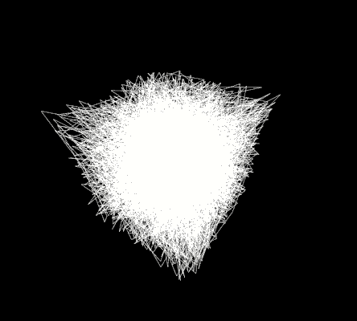
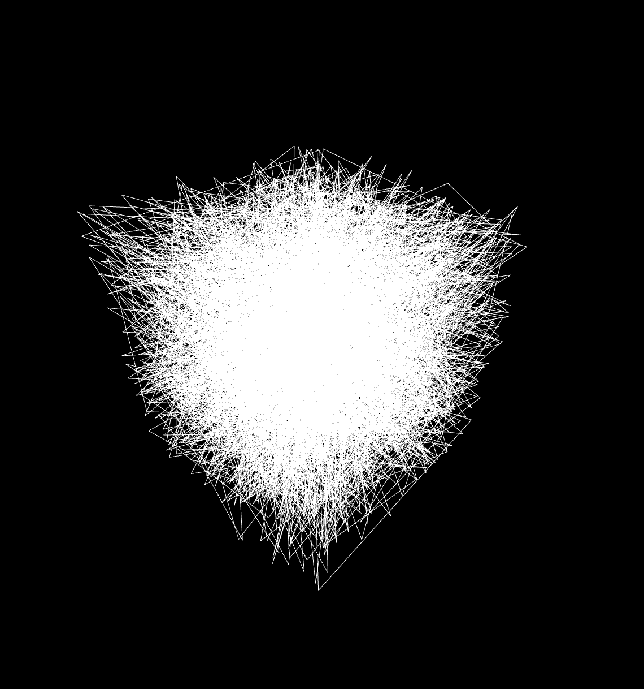
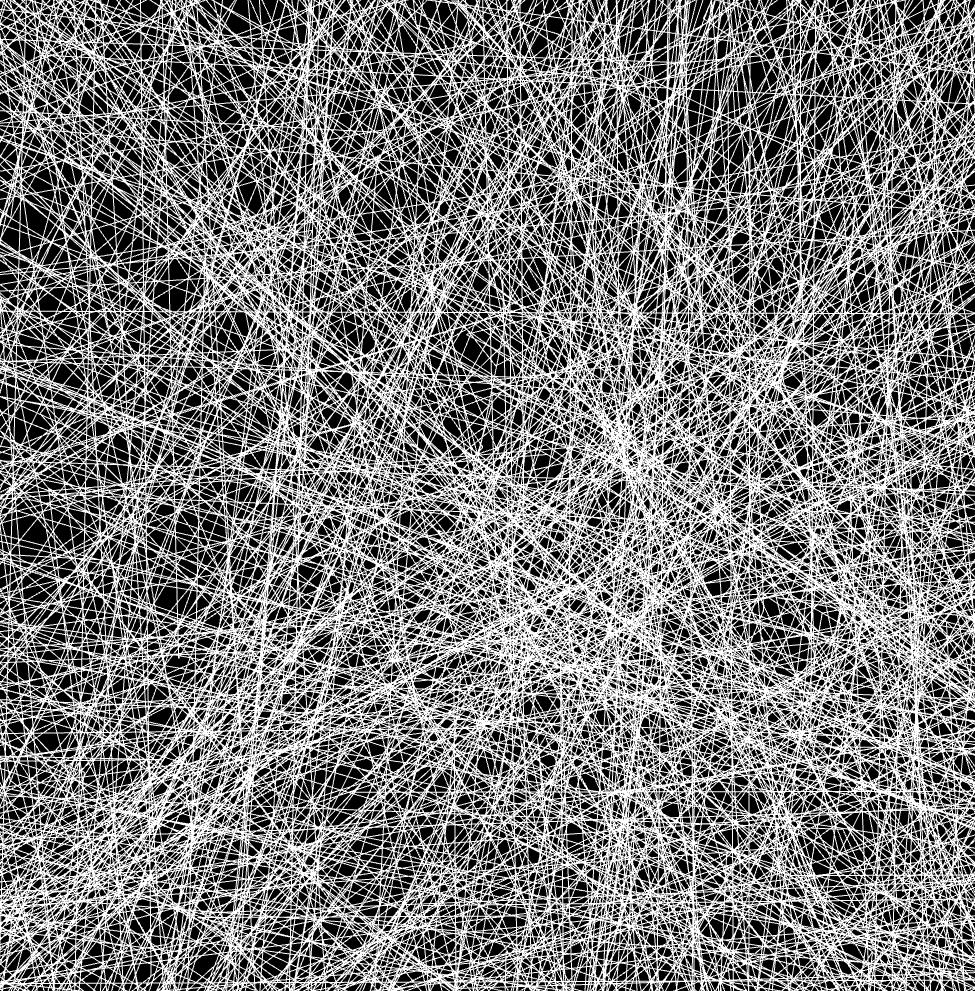

  
  
  <h3>Random triangles form a cube. Made with three.js.</h3>

  <h3><a href="https://random-triangles-cube.netlify.app/">Try me!</a></h3>

  

  
  
## Technologies Used

&nbsp;&nbsp;&nbsp;&nbsp;&nbsp;&nbsp;

&nbsp;&nbsp;&nbsp;&nbsp;&nbsp;&nbsp;
 
&nbsp;&nbsp;&nbsp;&nbsp;&nbsp;&nbsp;

&nbsp;&nbsp;&nbsp;&nbsp;&nbsp;&nbsp;

## Controls

- Scroll to zoom
- Hold left mouse button and move mouse to rotate
- Hold right mouse button and move mouse to pan
- Double-click to toggle fullscreen mode

## Screenshots

